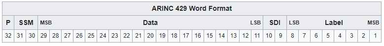

# ARINC-429 Protocol
Also known as Aeronautical Radio Inc., it is the predominant avionics data bus.
It defines the physical and electrical interfaces.

## ARIN-C429 features:
- 2-wire data bus (separate ports for Tx and Rx)
- For bi-directional transmission, two 2-wire pairs are required
- 32-bit words
- 1 pair is limited to 1 transmitter and up to 20 receivers
- protocol allows for self-clocking at the receiver end; eliminates the need to transmit clocking data
    - This is really good for eliminating single-bit errors in error checking
- Data is transmitted in Return-to-Zero format (HIGH, NULL, LOW) ~ (+10V, 0V, -10V)

## ARINC-429 Word Format:

32-bit Word [31, 0]

[31] = Parity bit
- For error detection

[30, 29] = SSM (Sign Status Matrix)
- Used to indicate sign or direction, and also to test if data is valid

[28, 10] = Data
- [28] = MSB
- [10] = LSB

[9, 8] = SDI (Source Destination Identifiers)
- Used by the transmitter to identify which receiver should process the message
- If not needed, may be used for data

[7, 0] = Label 
- Describes the data packet e.g. barometric data

